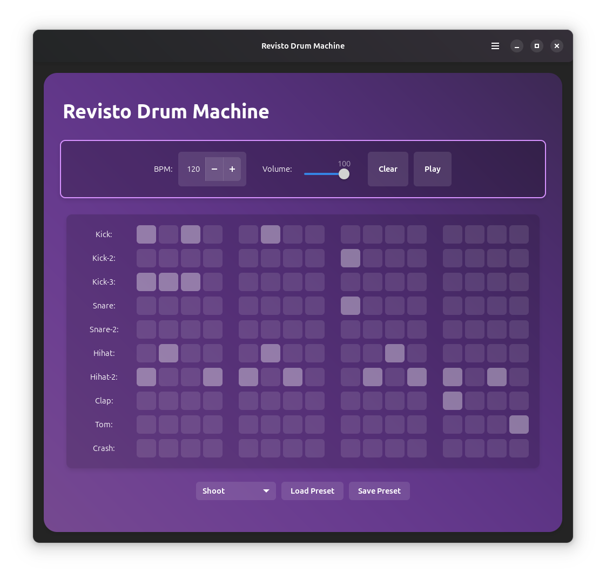

# Drum Machine

**Create and play drum beats**

<br>

[](https://github.com/revisto/drum-machine/blob/master/COPYING)

<p align="center">
  
</p>

## Description
Drum Machine is a modern and intuitive application for creating, playing, and managing drum patterns. Perfect for musicians, producers, and anyone interested in rhythm creation, this application provides a simple interface for drum pattern programming.

## Features
- Intuitive grid-based pattern editor
- Adjustable BPM control
- Volume control for overall mix
- Save and load preset patterns 
- Multiple drum sounds including kick, snare, hi-hat, and more
- Keyboard shortcuts for quick access to all functions
- Modern GTK4 and libadwaita interface

## Install

<a href="https://flathub.org/apps/details/io.github.revisto.drum-machine">

</a>

### Build from source

You can clone and run from GNOME Builder.

#### Requirements

- Python 3 `python`
- PyGObject `python-gobject`
- GTK4 `gtk4`
- libadwaita `libadwaita`
- pygame `pygame`
- mido `mido` 
- Meson `meson`
- Ninja `ninja`

Run these commands to build it with meson:
```bash
meson builddir --prefix=/usr/local
sudo ninja -C builddir install
```

## Keyboard Shortcuts

| Action | Shortcut |
|--------|----------|
| Play/Pause | Space |
| Clear All | Ctrl+Delete |
| Increase BPM | Plus/Equal |
| Decrease BPM | Minus |
| Increase Volume | Ctrl+Up |
| Decrease Volume | Ctrl+Down |
| Load Preset | Ctrl+O |
| Save Preset | Ctrl+S |
| Quit | Ctrl+Q |

## Credits
Developed by **[Revisto](https://github.com/revisto)**.

## License
This program is free software: you can redistribute it and/or modify it under the terms of the GNU General Public License as published by the Free Software Foundation, either version 3 of the License, or (at your option) any later version.