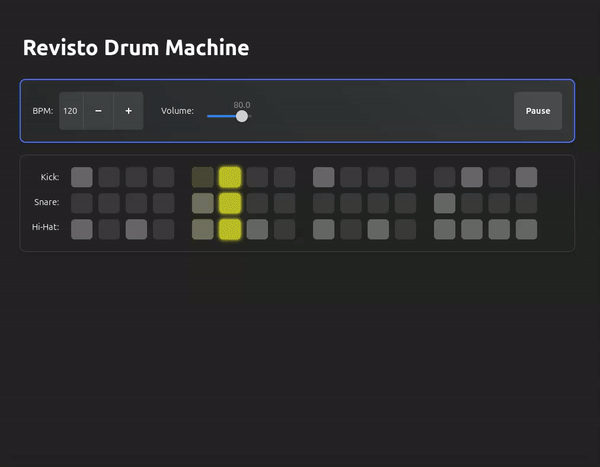

# 🥁 Rev Drum Machine

An interactive Drum Machine built with **Python**, **GTK4 (libadwaita)**, and **Pygame**! 🎵 Create beats, adjust the tempo, and unleash your inner rhythm!

## 🚀 Features

## 🚀 Features

- **16-Step Sequencer**: Toggle bars for 10 different drum parts:
  - Kick
  - Kick-2
  - Kick-3
  - Snare
  - Snare-2
  - Hi-Hat
  - Hi-Hat-2
  - Clap
  - Tom
  - Crash

- **BPM Control**: Adjust the tempo to match your groove.
- **Volume Adjustment**: Fine-tune the master volume.
- **MIDI Pattern Export**: Export your drum patterns as `.mid` files.
- **Default Patterns**: Load weird default patterns.
- **Pattern Import**: Import custom patterns from `.mid` files.

## 🎯 Goals

Our aim is to make this Drum Machine a part of the **GNOME Circle**. This means adhering to GNOME's high standards for design and integration.

## 📋 Roadmap

### **User Interface and Experience**

- 🖥️ **Responsive Design**: Ensure the UI works well across different screen sizes.
- 🎹 **Keyboard Shortcuts**: Implement intuitive shortcuts for toggling, playback control, and more.
- 🌗 **Dark Mode/Light Mode Support**: Seamless switching to match the user’s system theme.

### **Drum Machine Features**

- 💾 **Save and Load Projects**: Allow users to save and load their drum patterns and settings.
- 🎛️ **Effects and Modulations**: Add effects like reverb, delay, and pitch modulation.
- 🔢 **Step Sequencer Customization**: Let users adjust the number of steps beyond the default 16.
- 🥁 **More Drum Kits**: Provide more drum kits and allow users to load custom samples.
- 🎙️ **Audio Recording**: Enable recording of drum patterns as audio files (e.g., WAV, MP3).

### **GNOME Integration**

- 🤝 **Integration with GNOME Shell**: Provide app indicators, notifications, and settings integration.
- 📦 **Flatpak Packaging**: Package the app for easy installation on GNOME systems.

## 🛠️ Technologies Used

- **Python**
- **GTK4 (libadwaita)**
- **Pygame**
- **Meson Build System**

## 📸 Screenshots

*Add screenshots to showcase your application’s interface.*

## 🤔 Getting Started

*Instructions on how to download, build, and run your application.*

## 🌟 Contributing

*Guidelines on how others can contribute to your project.*

## 📄 License

This project is licensed under the **GNU General Public License v3.0** - see the LICENSE file for details.
