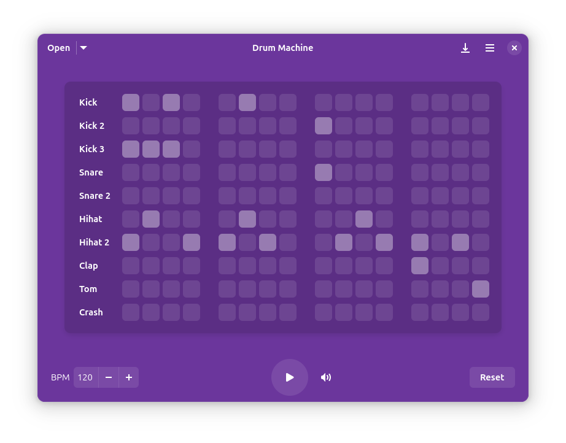

[license-url]: https://github.com/revisto/drum-machine/blob/master/COPYING
[license-image]: https://img.shields.io/github/license/revisto/drum-machine.svg?style=for-the-badge
[flathub-url]: https://flathub.org/apps/io.github.revisto.drum-machine
[flathub-image]: https://img.shields.io/flathub/v/io.github.revisto.drum-machine?logo=flathub&style=for-the-badge
[installs-image]: https://img.shields.io/flathub/downloads/io.github.revisto.drum-machine?style=for-the-badge
[issues-url]: https://github.com/revisto/drum-machine/issues
[issues-image]: https://img.shields.io/github/issues/revisto/drum-machine?style=for-the-badge
[persian-gnome-badge]: https://gnome-fa.github.io/assets/badges/persian-gnome.svg
[persian-gnome-url]: https://gnome_fa.t.me/

[circle-url]: https://apps.gnome.org/DrumMachine/
[circle-image]: https://circle.gnome.org/assets/button/badge.svg

  

  # Drum Machine

  **Create and play drum beats**

  [![GNOME Circle][circle-image]][circle-url] [![Persian GNOME][persian-gnome-badge]][persian-gnome-url]

  [![License][license-image]][license-url]
  [![Flathub][flathub-image]][flathub-url]
  [![Issues][issues-image]][issues-url]
  [![Installs][installs-image]][flathub-url]

  

## Description
Drum Machine is a modern and intuitive application for creating, playing, and managing drum patterns. Perfect for musicians, producers, and anyone interested in rhythm creation, this application provides a simple interface for drum pattern programming.

## Features
- Intuitive grid-based pattern editor with **infinite pages**
  - Navigate through unlimited pattern pages using carousel interface
  - Create complex drum sequences across multiple pages
- Adjustable BPM control
- Volume control for overall mix
- Save and load preset patterns 
- Multiple drum sounds including kick, snare, hi-hat, and more
- **Audio export with metadata support**
  - Export patterns in WAV, FLAC, OGG Vorbis, and MP3 formats
  - Add artist name, song title, and cover art metadata
  - Configurable pattern repeat count for longer exports
- Keyboard shortcuts for quick access to all functions
- Modern GTK4 and libadwaita interface

## Install

### Build from source

You can clone and run from GNOME Builder.

## Contribute
We need your help to make Drum Machine better!
There are lots of features that can be added, and we would love to see your contributions.

If you want to contribute to this project, you can fork the repository and submit a pull request. You can also report a bug or request a feature by opening an issue.

Your contributions are extremely welcome and appreciated.

## Translations
Drum Machine uses [GNOME Damned Lies](https://l10n.gnome.org/) for translation management. If you'd like to contribute translations, please visit the [Drum Machine translation page](https://l10n.gnome.org/module/drum-machine/) on GNOME Damned Lies rather than submitting pull requests with translation files.

## Credits
Developed by **[Revisto](https://github.com/revisto)**

Special thanks to **[Sepehr](https://github.com/sepehr-rs)** for triaging issues and helping maintain the project.

Special thanks to **[Tobias Bernard](https://tobiasbernard.com)** from the GNOME Circle Committee for helping Drum Machine look the way it does now and for all his valuable contributions.

Thanks to all contributors who help improve Drum Machine through code, bug reports, and feature requests.

Thanks to everyone contributing translations on [GNOME Damned Lies](https://l10n.gnome.org/module/drum-machine/), your work makes Drum Machine accessible to users worldwide.

  
  

## ❤️ Sponsor this project
Drum Machine is free software. If you like it and would like to support and fund it, you may donate through one of the platforms listed in the GitHub Sponsor section. Any amount will be greatly appreciated 🤩.

## License
This program is free software: you can redistribute it and/or modify it under the terms of the GNU General Public License as published by the Free Software Foundation, either version 3 of the License, or (at your option) any later version.

## Code of Conduct
We follow the [GNOME Code of Conduct](https://wiki.gnome.org/Foundation/CodeOfConduct) to ensure a welcoming environment for everyone. Be kind, be respectful, and help us build something awesome and fun together. 
